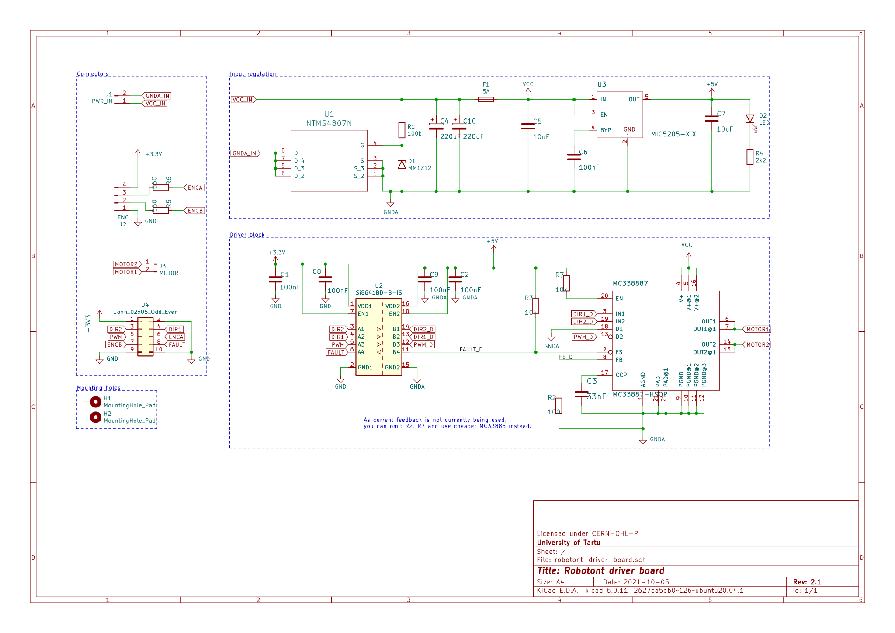
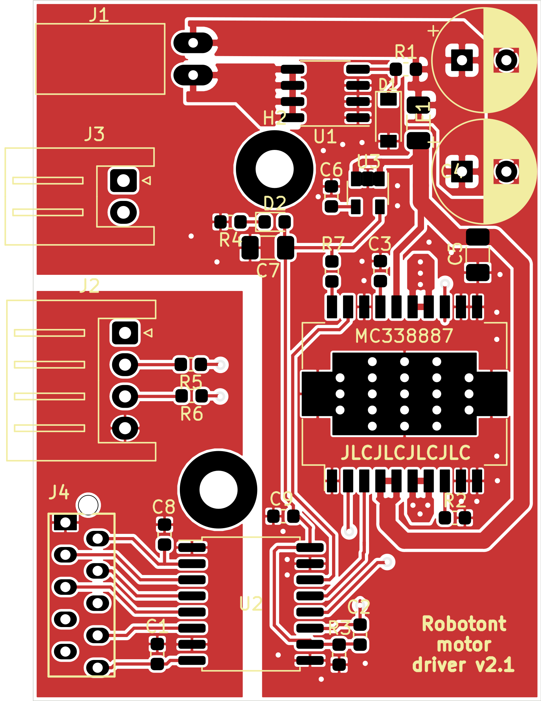
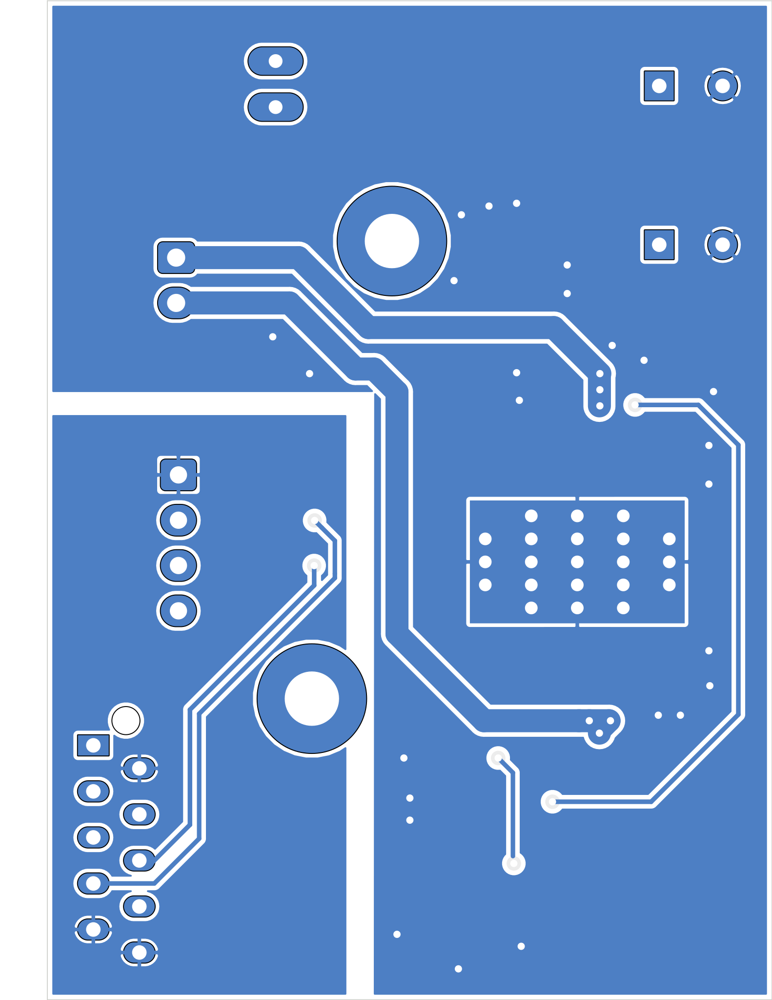
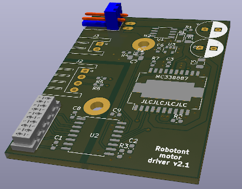

# robotont-electronics-driver-board
The repository contains KiCAD schematics and PCB layout for the motor driver board.
The [production](Production/) folder contains prepared gerbers with pos file ready to order a from e.g. JLCPCB.

## Schematics

## Layout

The following figures visualize the front and back side of the driver board along with the 3D model of the design.

